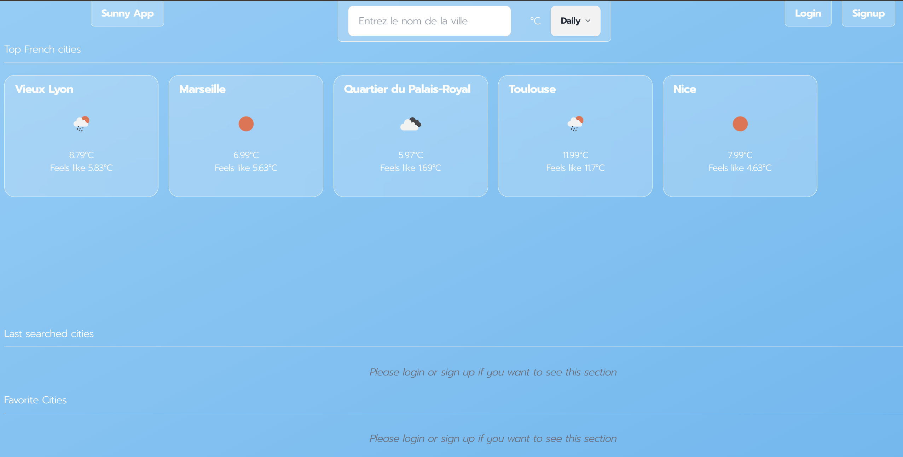
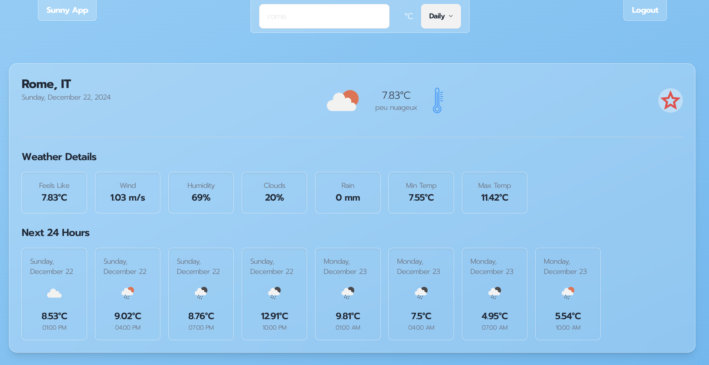
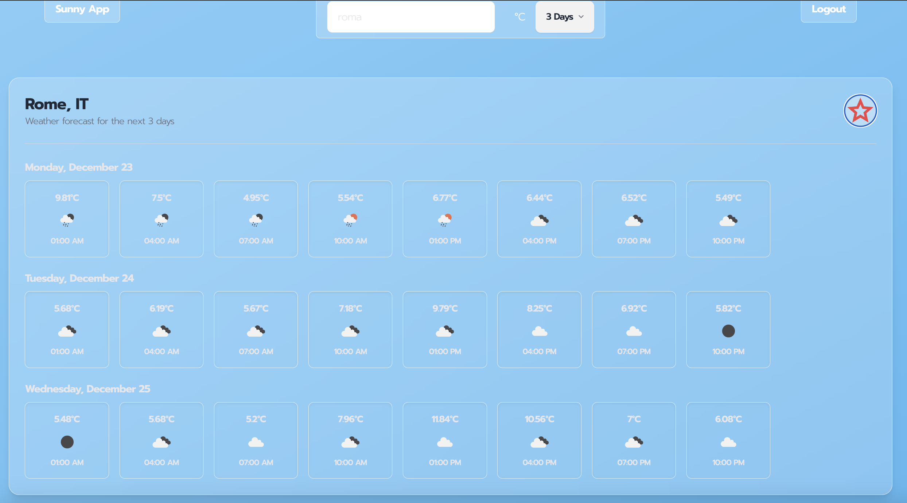

☀️ Sunny App is front-end a **weather forecasting app** where users can search and save selected cities 🌐 

Built with **TypeScript** (**Angular** and **Tailwind/Daisy UI** for the front-end), **OpenWeatherMap** weather API and **JSON server** for the back-end.

## Detailed description

This weather application lets you explore **real-time weather conditions and forecasts for any city**, with the option to view temperatures in **Fahrenheit** or **Celsius**. It provides current weather updates, a 3-day forecast, and the ability to save favorite cities for quick access. Additionally, you can review the weather for your recently viewed cities, all conveniently displayed on your home page.

## PAGES AND MAIN FEATURES

## Home Page

- Here an unauthenticated users can only acces the **Top French cities** weather section
- Authenticated users also have access to the **Last searched cities** and **Favorite Cities** sections
- On the top of the page there is a **searchbar** where users can enter a location name, choose the temperature type and choose if they want to see the **daily detailed** or the **three days detailed** weather forecast

## Login and Signup Pages
- Here users can sign up and sign in with a **email** and a **password**

## Location Page

- This page is accessed once users enter a city name is the searchbar
- Two cards can appear: the  **daily detailed** or the **three days detailed** weather forecast.
- From both of these cards, authenticated users can **add a city to their favorites**

## Last Searches Page
- On this page authenticated users can see their last searched cities list
- This page is accessed from the Home Page, by clicking on the **See last Searched** button

## Favorites Page
- On this page authenticated users can see their favorite cities list
- This page is accessed from the Home Page, by clicking on the **See Favorites** button

## Installation

### Prerequisites

-  Node.js `v18.20.5`
- Angular CLI 16 `npm install -g @angular/cli@16.0.0`

### Setting up and launching the server
1. Clone the repository to your local machine.
2. Navigate to the `Weather_App` directory  (`cd Weather_App`) and install the required dependencies with `npm install`.
3. Run the JSON server from the `Weather_App` directory : `npm run json-server`.
4. Open your browser and navigate to `http://localhost:3000` to acces the api.

### Setting up and launching the client
1. You have cloned the repository on your local machine
2. Navigate to the `Weather_App` directory and install the required dependencies with `npm install` (if you have not done it yet).
3. Navigate to the `src` directory and launch the client with `ng serve`.
4. Open your browser and navigate to `http://localhost:4200` to start using the application.
5. If you want to have full access to the app's functionalities, please Sign up !

### Authors

- Sara BEVILACQUA
- Julien CHAZAL
- Robin MALPART